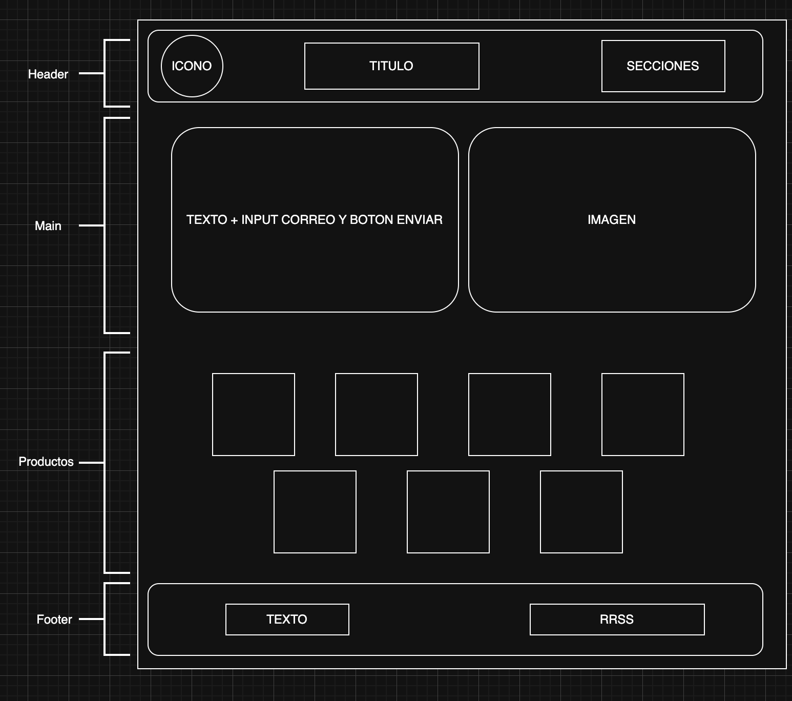
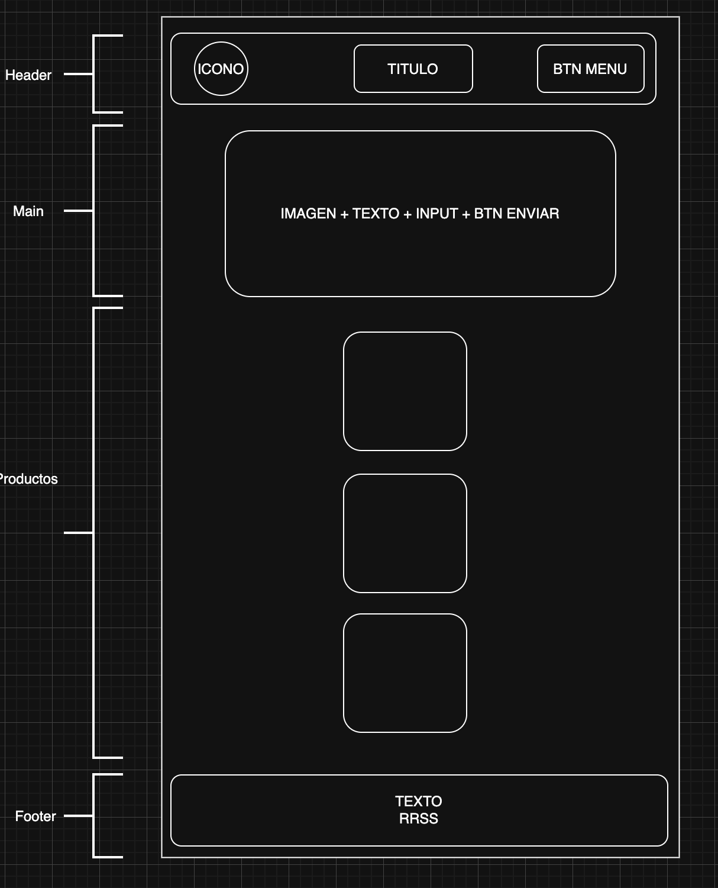

# Proyecto Landing de Negocio
## Superpoderes

Creamos una Landing con HTML y CSS en la que tenemos los siguientes elementos.
Header, Main, Body (Products) y footer.

Añadimos imagen directamente en el proyecto (Icono e imagen principal) y otras fueron enlazadas a otros sitios web (Productos).

En el head tenemos la conexion con la neva fuente utilizada, Boostrap, CSS y Favicon.

Se utilizan clases de boostrap para dar estilos y responsividad a los componentes del sitio.

Dentro del CSS tenemos el reset de parametros, actualizacion de estilos a ciertos componentes y modificaciones de estilos con mediaQuerys para modificar elementos en algunas resoluciones.

Diseño de Prototipo Desktop

Diseño de Prototipo Mobile

